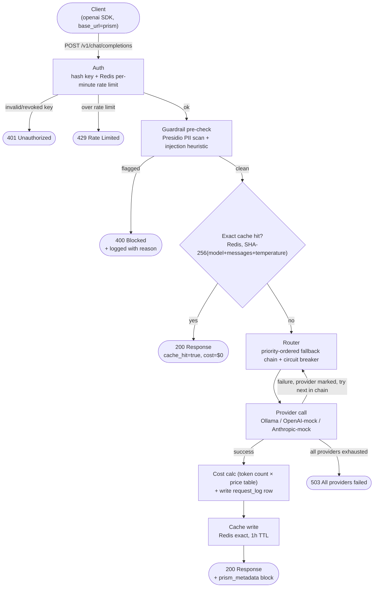
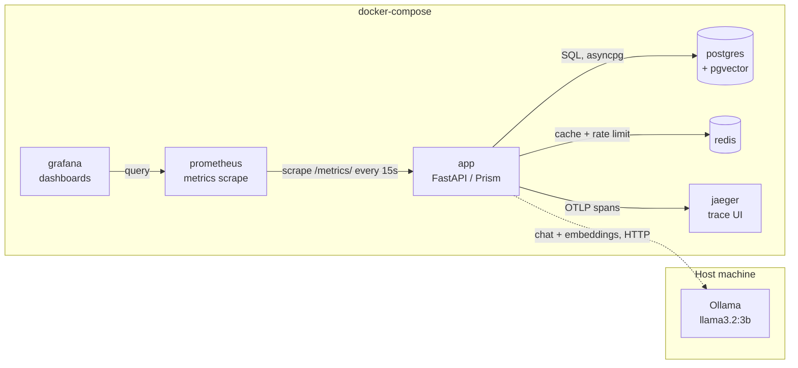

# Prism — LLM Gateway & Control Plane

A production-shaped proxy layer that sits between your applications and the
LLM providers you actually use — self-hosted Ollama, OpenAI, Anthropic —
and gives you the things ungoverned LLM access doesn't have: cost
visibility, automatic failover, PII/prompt-injection guardrails, semantic
and exact caching, and per-team usage tracking. Any client using the
standard `openai` Python SDK works against Prism with a one-line
`base_url` change — no other code changes.

See [`docs/architecture.md`](docs/architecture.md) for the full diagrams
reproduced below, plus a note on one thing that's built but not wired in.

## Why this exists

Every team that scales past "call OpenAI directly from the app" runs into
the same five problems at once: unpredictable cost, no visibility into
failures, security exposure (PII leakage, prompt injection), no resilience
when a provider degrades, and no way to swap models without touching
application code. Commercial products in this exact category — LiteLLM,
Portkey, Helicone, Kong AI Gateway — are venture-funded because the
problem is real. Prism is a real, working version of that same idea, built
solo, with the tradeoffs made explicit rather than hidden.

## Architecture

### Request flow

Every call to `/v1/chat/completions` passes through the same pipeline.
Two paths exit early — a guardrail block and an exact-cache hit — both
skipping the provider call (and its cost) entirely.



### Infrastructure

Everything except Ollama runs in `docker-compose`. Ollama runs on the host
(Metal-accelerated on Apple Silicon) — the app reaches it over the network
like any other provider.



An admin dashboard (`GET /admin/dashboard`, HTTP Basic Auth) gives a
four-tab view — Overview, Cost & Teams, Performance, Safety — over the
trailing 24h, built with hand-rolled vanilla JS and inline SVG charts (no
chart library, no build step) alongside the Grafana operational
dashboards.

## Key design decisions

| Decision | Choice made | Alternative | Why |
|---|---|---|---|
| Deployment target | Docker Compose, local only | Kubernetes (EKS) + Terraform | Deliberately scoped out — see [What I'd change](#what-id-change-at-real-scale). Local keeps the loop fast and the whole system demoable without cloud spend; the tradeoff is real and stated, not hidden. |
| Self-hosted model | Ollama, not vLLM | vLLM | No GPU needed; runs via Metal on Apple Silicon with an OpenAI-compatible API out of the box. |
| Vector store | pgvector on the existing Postgres | Standalone Pinecone/Weaviate | Avoids a 4th moving part. **Currently unused in the live request path** — `get_semantic`/`store_semantic` exist in `cache.py` but the chat endpoint only calls the exact-match Redis cache. Only exact-match caching is live today. |
| Circuit breaker | Hand-rolled state machine (closed/open/half-open, 3-failure threshold, 30s cooldown) | `pybreaker` library | Built this one component from scratch deliberately, to demonstrate understanding of the pattern rather than just importing it. Everywhere else in the stack uses standard libraries. |
| Prompt-injection detection | Regex/heuristic scorer | Fine-tuned classifier / LLM-as-judge | Honest about its limits, fast, no added inference cost. A named "v1" with a clear upgrade path, not a permanent choice. |
| Admin UI | Custom server-rendered dashboard (Jinja2 + vanilla JS + inline SVG) | Streamlit | Ended up more built-out than the original "minimal, don't let it eat the timeline" plan — four tabs, real aggregation queries, hand-rolled charts — because it doubles as a demonstration of frontend fundamentals without a framework or build step. |

## Benchmarks

Real numbers from a Locust load test (`src/tests/load/`), not estimates —
see [`src/tests/load/README.md`](src/tests/load/README.md) for the exact
run procedure. Machine: M4 Pro, single `uvicorn` process, no distributed
Locust workers.

| Metric | Result |
|---|---|
| Combined throughput | ~245–259 req/s aggregate, 0% unintended error rate |
| Gateway overhead (isolated from provider latency), 10 concurrent users | p50 ~25ms, p95 ~80ms |
| Gateway overhead, 50 concurrent users | p50 ~130ms, p95 ~250ms, p99 ~340ms — the spec's own "<50ms p95" target holds at low concurrency and is exceeded once the single process approaches saturation, which is exactly the kind of ceiling a load test should surface |
| Real Ollama inference vs. mock providers | Ollama avg 595ms / p95 1134ms, vs. openai-mock avg 12.6ms, cache avg 7.9ms — this is the actual gateway-overhead-vs-provider-latency isolation the numbers above are built to show |
| Cache hit rate | ~20% of traffic, ~$0.06 saved via cache over a 2-minute run at the traffic mix used |
| Guardrail block rate | ~9.9% (matches the intentional 10% weighted share of PII-triggering requests in the load test's traffic mix) |
| **Fallback chain, provider outage simulated** | With Ollama made completely unreachable, error rate on `fast`-model requests stayed at **0.00%** (1 stray timeout out of 31,488 requests) — every request that would have gone to Ollama instead failed over to the mock providers, confirmed via the admin dashboard's provider mix shifting to `openai` during the run |

One real bug this load test found and fixed: `auth.py`'s rate limiter and
`cache.py`'s exact cache each opened a **new Redis connection per
request** instead of reusing a shared pool. At ~300 req/s that's hundreds
of new connections/sec, and Redis started closing them under the churn —
a 77% error rate before the fix, 0% after. Fixed by adding one
module-level shared client (`src/prism/core/redis_client.py`), mirroring
the pattern the Postgres engine already used correctly.

## Running it locally

```bash
docker-compose up -d
# migrations run via alembic; see docker-compose.yml for service wiring
```

This brings up the app, Postgres (with pgvector), Redis, Jaeger, Prometheus,
and Grafana. Ollama runs separately on the host (`ollama serve`, with
`llama3.2:3b` and `nomic-embed-text` pulled) since it isn't containerized.

Cloud deployment (EKS, Terraform, RDS, ElastiCache) was scoped out of this
build on purpose — see the deployment row in
[Key design decisions](#key-design-decisions) — not because it wasn't
considered, but because a fast local loop mattered more for this project's
goals than a teardown-able cloud environment would have added.

## What I'd change at real scale

- **Now**: single FastAPI process, single Postgres primary, single Redis
  instance — sized for the load test above (hundreds of req/s), not
  Google-scale traffic.
- **At real scale**: Postgres read replicas for the analytics/dashboard
  queries, Redis Cluster instead of single-node, horizontal autoscaling
  keyed on request latency/queue depth, and a queue (SQS/Kafka) to
  decouple cost-calculation/logging from the hot request path if that
  ever became the bottleneck.
- **Failure domains, stated explicitly rather than left to guesswork**:
  Postgres down currently fails auth closed — no key validation, no
  requests served. That's deliberate. Redis down is **not** currently
  graceful — before the fix above it crashed every request with a 500;
  after the fix it's a single shared client so a Redis outage still
  surfaces as request failures rather than the "skip caching, degrade to
  DB-only rate limiting" behavior a production system would want. That's
  a real, known gap, not a hidden one — it's the next thing I'd build if
  this were going further.
- **Semantic cache** is implemented (`cache.py`) but not wired into the
  request path — only exact-match caching is live. Wiring it in (or
  removing the dead code if it's not worth the embedding-call latency
  tradeoff) is a real, scoped follow-up, not an oversight discovered
  after the fact.

---

## Resume & Interview Notes

**Resume bullets** (kept honest to what's actually built — no Kubernetes
or Terraform claims, since deployment was deliberately scoped to local):

- Designed and built a multi-provider LLM gateway (FastAPI, Postgres,
  Redis) implementing automatic failover with a hand-rolled circuit
  breaker, exact-match caching, and prompt-injection/PII guardrails;
  load-tested to ~250 req/s with 0% error rate and 0% error rate
  maintained through a simulated full provider outage via the fallback
  chain.
- Built full observability (OpenTelemetry, Prometheus, Grafana, plus a
  hand-rolled admin analytics dashboard) into the service, enabling
  real-time cost, latency, and error-rate tracking per team; instrumented
  CI/CD (GitHub Actions: lint → type-check → test via testcontainers →
  Docker build → Trivy container scan) as a required merge gate.
- Found and fixed a real concurrency bug via load testing — a per-request
  Redis connection pattern that caused a 77% failure rate under load —
  demonstrating the value of load testing beyond "does it work," to "does
  it keep working under concurrency."

**STAR interview narrative:**
*Situation*: LLM usage at most companies is ungoverned — no cost
visibility, no failover, no safety checks.
*Task*: build a real gateway that addresses all four at once, scoped
honestly rather than padded with unused infrastructure.
*Action*: walk through the request lifecycle diagram above, the circuit
breaker/fallback design, and one specific hard call — e.g., why a
heuristic injection scorer over a fine-tuned classifier, or why the
semantic cache got built but deliberately not wired in yet.
*Result*: the real benchmark numbers above, and the two things I'd fix
next if this went further: Redis failure-domain graceful degradation, and
either wiring in or removing the dead semantic-cache code.
