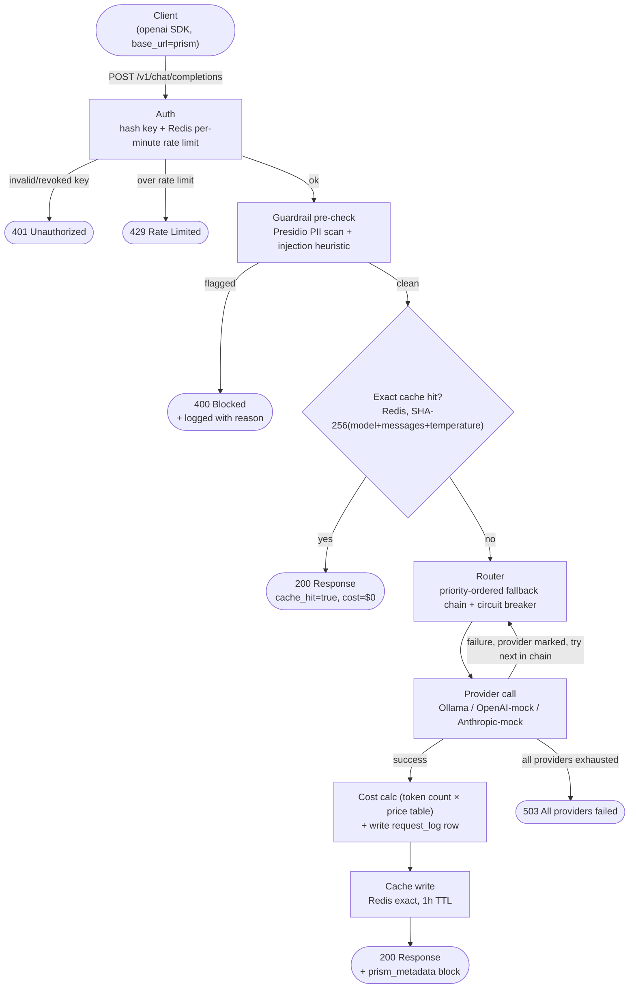
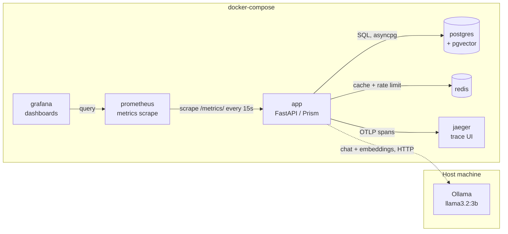

# Prism — Architecture

Two views of the system: how a single request flows through the gateway, and
how the pieces are deployed together.

## Request Flow

Every call to `/v1/chat/completions` passes through the same pipeline. Two
paths exit early — a guardrail block and an exact-cache hit — both skipping
the provider call (and its cost) entirely.

**Notes:**
- The circuit breaker (closed/open/half-open, threshold 3 failures, 30s
  cooldown) sits inside the Router step — an open circuit for a provider
  skips straight to the next one in the chain without attempting the call.
- `prism_metadata` on every response reports `provider_used`, `cache_hit`,
  `fallback_triggered`, `cost_usd`, and `latency_ms` — this is what the
  admin dashboard's Overview/Performance/Safety tabs aggregate.
- `cache.py` also defines a semantic (pgvector cosine-similarity) cache
  tier, but it isn't currently called from the chat endpoint — only the
  exact-match Redis cache shown above is live in the request path.

## Infrastructure Topology

Everything except Ollama runs in `docker-compose`. Ollama runs on the host
(Metal-accelerated on Apple Silicon) — the app reaches it over the network
like any other provider, which is why it's drawn outside the compose
boundary.

**Notes:**
- `app` depends on `postgres`, `redis`, and `jaeger` being healthy before it
  starts (`docker-compose.yml` healthchecks); `prometheus` depends on `app`;
  `grafana` depends on `prometheus` and comes with the Prism dashboard
  auto-provisioned.
- The admin dashboard (`/admin/dashboard`) queries `postgres` directly — it
  isn't a separate service, just another route on `app`.
